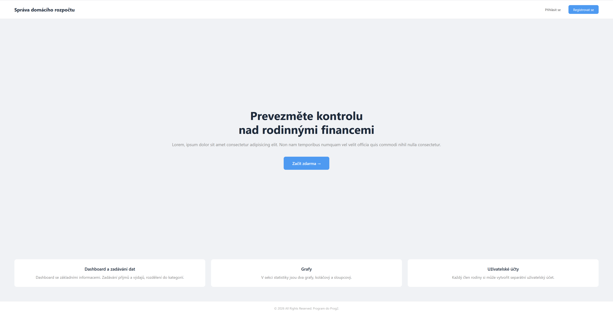
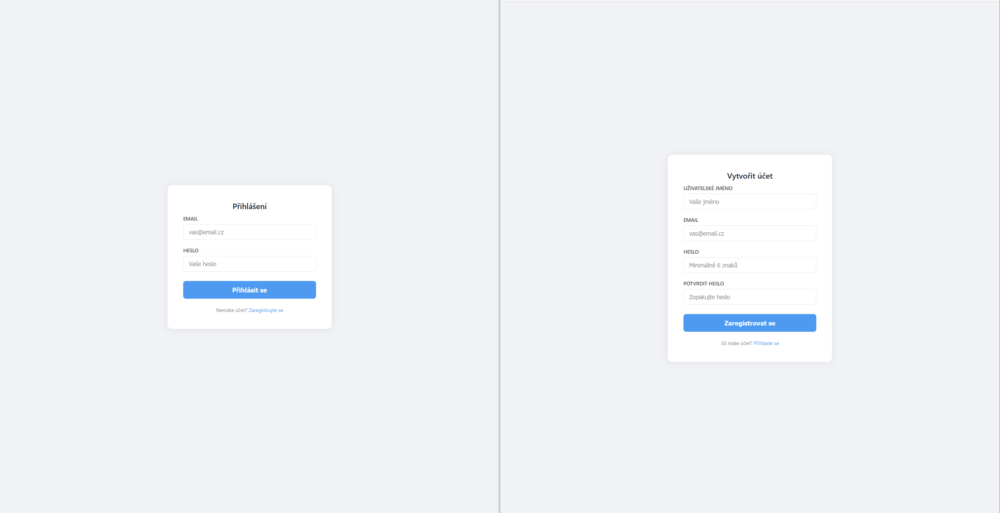
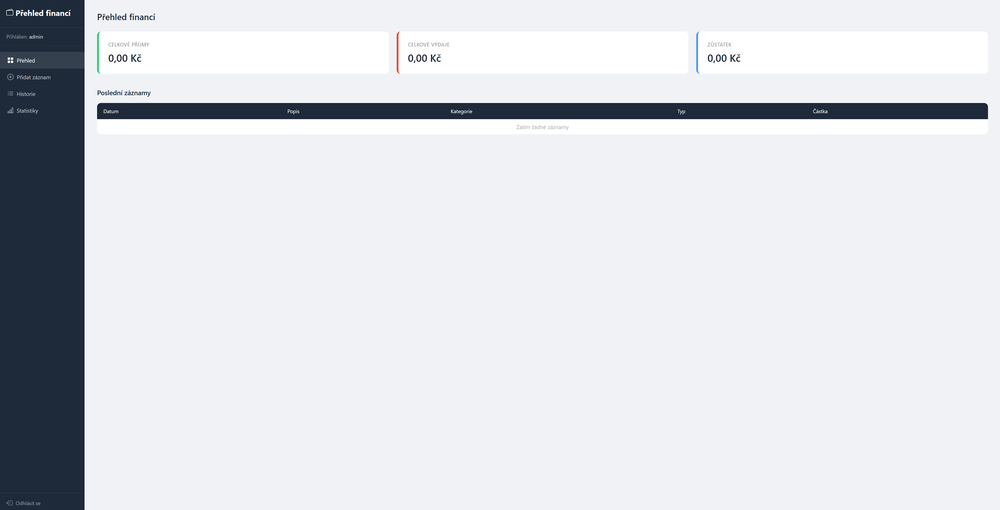
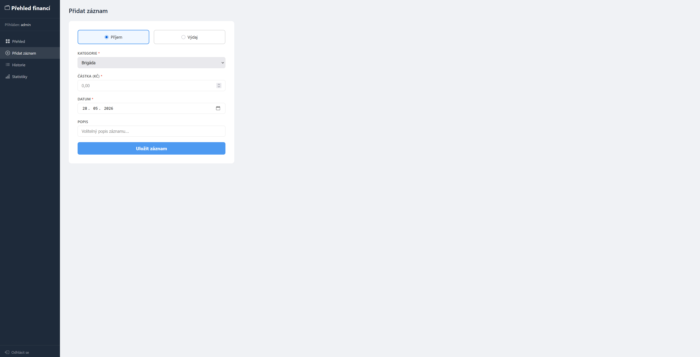
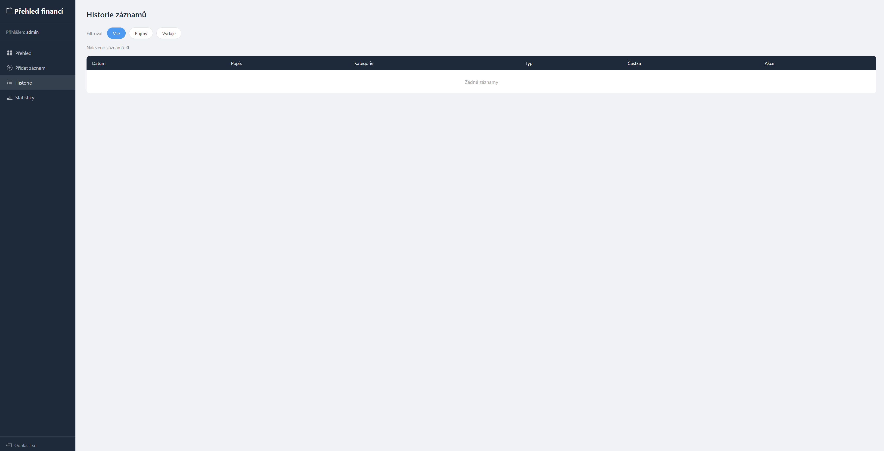
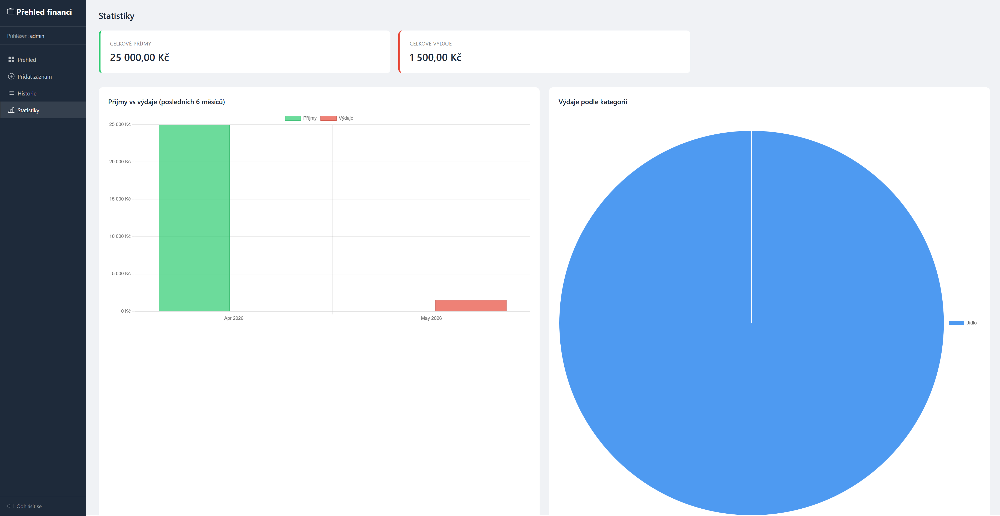

# Správa domácího rozpočtu

Školní projekt do Programování 2

## Úvod

Webová aplikace pro správu osobních nebo rodinných financí. Umožňuje zapisovat příjmy a výdaje,
sledovat historii transakcí a zobrazovat transakce v grafech. Každý uživatel má vlastní účet a vidí pouze své transakce.

## Analýza problému

Cílem bylo vytvořit jednoduchou webou aplikaci pro sledování rozpočtu. Aplikace má podle zadání umět zadávání výdajů a příjmů, přehled financí a má obsahovat grafy.

## Struktura projektu a souborů

```
/sprava_rozpoctu/
  ├── index.php          – úvodní stránka
  ├── login.php          – přihlášení
  ├── register.php       – registrace
  ├── logout.php         – odhlášení
  ├── dashboard.php      – přehled financí
  ├── pridat.php         – přidání záznamu
  ├── historie.php       – historie s editací
  ├── statistiky.php     – grafy
  ├── layout.php         – šablona
  ├── config.php         – připojení k databázi
  ├── home_budget.sql    – SQL dump
  ├── js/
  │   └── app.js         – grafy, inline editace, přepínání kategorií
  └── css/
      ├── base.css       – globální css
      ├── auth.css       – přihlášení a registrace
      ├── landing.css    – úvodní stránka
      ├── pridat.css     – formulář přidávání transakcí
      ├── historie.css   – historie
      └── statistiky.css – grafy


```

## Návrh databáze

Databáze home_budget obsahuje tři tabulky.

**users** – uživatelé (id, username, email, password)

**categories** –  kategorie příjmů a výdajů (id, name, type)

kategorie příjmů: Plat, Brigáda, Ostatní příjem.  
kategorie výdajů: Doprava, Jídlo, Nájem, Oblečení, Ostatní výdaj, Zábava, Zdraví

**transactions** – záznamy transakcí (id, user_id, type, category, amount, description, date)

Tabulka transactions je propojena s users přes foreign key user_id.

## Popis funkcionalit

**Registrace a přihlášení** – uživatel se registruje pomocí jména, e-mailu a hesla. Heslo je hashováno pomocí bcrypt. Nepřihlášený uživatel je přesměrován na přihlašovací stránku.

**Dashboard** – po přihlášení zobrazí celkové příjmy, výdaje a aktuální zůstatek. Pod tím je tabulka posledních 5 transakcí.

**Přidání záznamu** – formulář pro zadání příjmu nebo výdaje. Uživatel vybere typ, kategorii (dynamicky se přepíná podle typu), zadá částku, datum a volitelný popis. Data se validují na serveru a ukládají přes prepared statement.

**Historie** – seznam všech transakcí s filtrováním podle typu (příjmy / výdaje). Každý záznam lze inline editnout nebo smazat. Editace funguje přes AJAX.

**Statistiky** – sloupcový graf příjmů a výdajů za posledních 6 měsíců a koláčový graf výdajů podle kategorií. Grafy jsou vykresleny pomocí Chart.js, data se předávají ze serveru jako JSON.


## Ukázky obrazovek

### Landing page


### Login a registrace



### Dashboard



### Přidání záznamu



### Historie



### Statistiky a grafy

pro ukázku grafů jsou zadané testovací transakce



## Instalace a spuštění

1. Nainstalujte XAMPP a spusťte Apache a MySQL.
2. Zkopírujte složku `sprava_rozpoctu/` do `C:\xampp\htdocs\`.
3. V phpMyAdmin vytvořte databázi `home_budget`.
4. Importujte soubor `home_budget.sql`.
5. Otevřete `http://localhost/sprava_rozpoctu` v prohlížeči.
6. Zaregistrujte účet.

## Závěr

Aplikace byla vytvořena podle zadání. Při vývoji aplikace jsem zjistil že programování GUI mě né zcela vyhovuje, a proto
jsem spíše kladl důraz na bezpečnost a funkcionalitu.

Do budoucna bych chtěl aplikaci rozšířit o funkční export a import přes CSV, zapracování opakujících se transakcí,
dobré by taky bylo rozšíření o správu více účtů pro členy jedné rodiny.